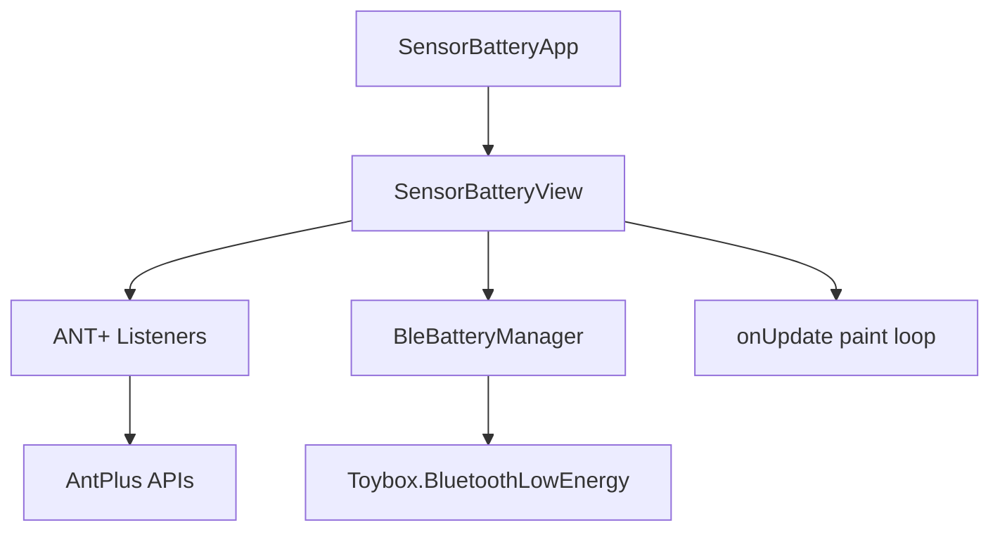

# Architecture

## Overview

Sensor Battery is a Connect IQ **data field** (`type="datafield"` in `manifest.xml`). It displays battery status for cycling sensors connected via ANT+ and BLE on a single scrolling list.

## Source files

| File | Lines | Role |
|------|-------|------|
| `SensorBatteryApp.mc` | ~35 | App entry, creates View, reloads settings |
| `SensorBatteryView.mc` | ~1976 | Data field UI, ANT+ listeners, row rendering |
| `SensorBatteryBackground.mc` | ~28 | White background drawable |
| `BleBatteryManager.mc` | ~2060 | BLE scan/pair/read state machine |

## SensorBatteryView

Extends `WatchUi.DataField`. Owns all ANT+ sensor subscriptions and the display logic.

### ANT+ listeners (inner classes)

| Listener | AntPlus type | Battery source |
|----------|--------------|----------------|
| `MyShiftingListener` | Shifting | Per-component Di2 battery |
| `MyBikeRadarListener` | BikeRadar | Rear Varia light (same device) |
| `MyLightNetworkListener` | LightNetwork | Front light |
| `MyBikePowerListener` | BikePower | L/R power meter |
| `MyBikeCadenceListener` | BikeCadence | Cadence sensor |
| `MyBikeSpeedListener` | BikeSpeed | Speed sensor |

Lifecycle is managed in `syncSensorLifecycle()` — listeners are created/destroyed based on user settings and activity state.

### Display pipeline

1. `compute()` / `computeInner()` — poll ANT+ data, advance BLE manager, feed ANT IDs to BLE for matching
2. `onUpdate()` / `onUpdateInner()` — build row buffers (`mRowSortKeys`, `mRowTexts`, `mRowColors`), sort by position, draw with adaptive font ladder

Row buffers are reused each frame to avoid allocations on constrained devices.

### Identity feed (ANT → BLE)

`feedAntIdsToBleMgr()` and related helpers push registered sensor IDs, names, and optional BLE addresses from Garmin's sensor registry into `BleBatteryManager`. This lets BLE scans match the correct HRM, power meter, or Di2 unit when multiple devices are nearby.

Key methods:
- `maybeFeedAntIdsToBleMgr()` — throttled full feed (every 15 ticks)
- `pushLiveHrmAntTarget()` — updates live HRM ANT ID when HR data is active
- `pushLiveAntIdsCheap()` — lightweight live ID updates for PM and Di2

## BleBatteryManager

Manages BLE battery reads for three device types in a round-robin:

| Slot | Device | Refresh interval |
|------|--------|------------------|
| `DEV_HRM` (1) | Heart rate monitor | 1200 ticks |
| `DEV_PM` (2) | Power meter | 7200 ticks |
| `DEV_DI2` (0) | Shimano Di2 | 7200 ticks |

### Phase state machine

When several slots need sampling, phases run in priority order: PM → PM_WAIT → Di2 → DI2_WAIT → HRM → HRM_WAIT → IDLE.

Each phase: scan → pair (deferred to `compute()`, not scan callback — CIQQA-4261) → discover Battery Service → read characteristic → disconnect → next phase. Battery values remain cached for display, but no BLE device intentionally remains connected while the manager is idle.

### Manager states

`MGR_OFF` → `MGR_SCANNING` → `MGR_RUNNING` → back to scanning, with `MGR_ERROR` / `MGR_IDLE` for backoff.

Per-device states: `DS_IDLE` → `DS_PAIRING` → `DS_SUBSCRIBING` → `DS_ACTIVE` → `DS_DISCONNECTED`.

### Matching

BLE scan results are matched against ANT candidate IDs and Garmin-stored sensor names using:
- `MATCH_ID` — ANT ID match
- `MATCH_STRICT` — ID + name match
- Optional BLE address from `SensorInfo`

HRM and PM sample only while Garmin reports that category active (PM via the ANT+
BikePower listener; HRM via recent activity heart-rate data). Candidates are ranked
independently across scan callbacks. The active ANT ID wins when available; if no
matching advertisement appears in the first 10-tick window, a second window starts
after 20 ticks. With no ID match, the strongest compatible advertisement in that
category is selected. A fallback battery is rechecked after 120 ticks so a sensor
that advertises its ID later can replace it. Exhausted searches also restart after
120 ticks while the Garmin sensor remains active.

Only the scan-window winner's name and ranking values are retained. Pairing waits
for a fresh advertisement with that name (or a strongest compatible result if
unnamed) and is deferred to `compute()` via `processPendingPair()`, never started
from a scan callback. On a successful read, the
battery percentage and source name are cached together: use the Garmin name associated
with a matched ANT ID, or otherwise the selected BLE-advertised name. Failed scans,
pairs, and reads do not relabel an already cached battery. Di2 discovery, Shimano
filtering, serial verification, and naming remain unchanged.

## Settings integration

`loadSettings()` reads Connect IQ properties and toggles sensor visibility, row positions, text zoom, debug mode, and BLE rescan flag. Changes trigger `syncSensorLifecycle()` to start/stop listeners.

## Permissions

From `manifest.xml`: Ant, BluetoothLowEnergy, Sensor, SensorHistory, UserProfile.
