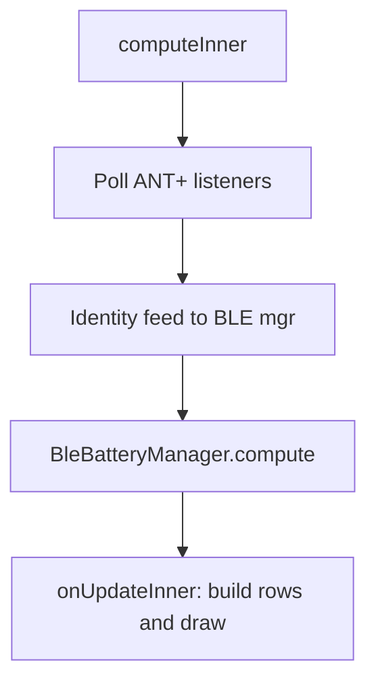
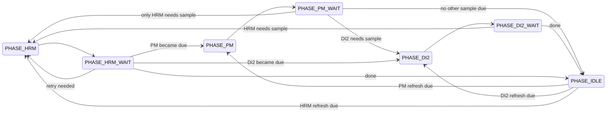
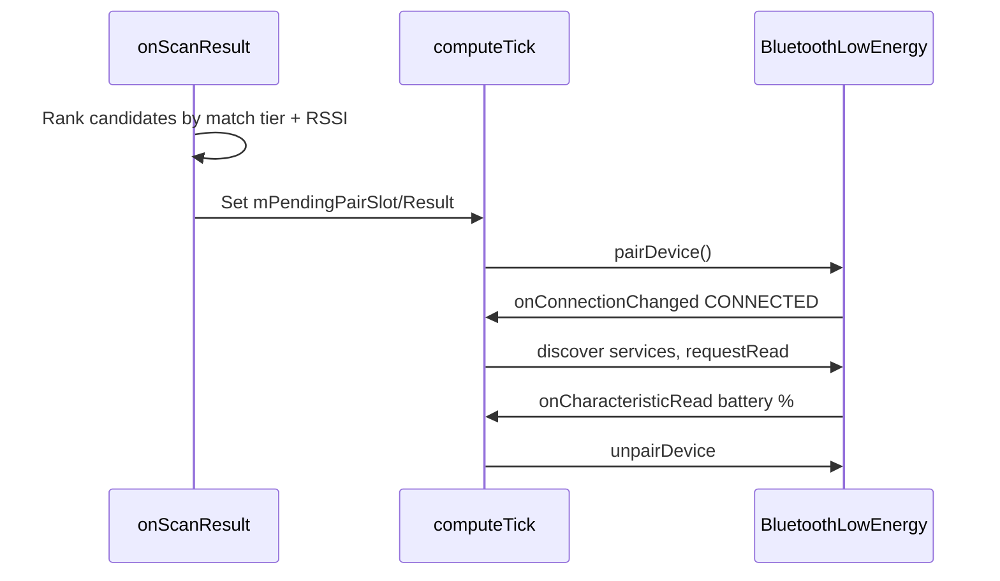

# Functional specification

Detailed behavior of the Sensor Battery Connect IQ data field, derived from `source/SensorBatteryView.mc` and `source/BleBatteryManager.mc`.

## App identity

| Property | Value |
|----------|-------|
| Name | Sensors Battery |
| Type | Data field |
| Entry class | `SensorBatteryApp` |
| View class | `SensorBatteryView` |
| Min API | 3.3.0 |
| App UUID | `d501f5c0-10e0-4870-a4ae-ee095de5c680` |
| Supported devices | 59 products in `manifest.xml` |

### Permissions

Ant, BluetoothLowEnergy, Sensor, SensorHistory, UserProfile

---

## Time base

All timeouts and intervals in `BleBatteryManager` are measured in **ticks**: one tick per `compute()` call from the data field. In an active activity this is typically ~1 Hz, so **45 ticks ≈ 45 seconds** unless the field is paused.

---

## Main loop

Each activity frame:

1. **`computeInner`** — read ANT+ battery data (PM, shifting, cadence, speed, lights, radar), run BLE manager, merge BLE battery into display state.
2. **`onUpdateInner`** — build sortable row buffers, pick fonts, draw title + rows.

Row buffers (`mRowSortKeys`, `mRowTexts`, `mRowColors`) are reused every frame to avoid allocations.

---

## Display rows

### Row ordering

Each sensor type has a user-configurable position (1–8). Rows are sorted by `position * 10 + subIndex` so multiple lines from one sensor stay grouped (e.g. debug shift rows).

### Battery status → display

| AntPlus status | Shown text | Color |
|----------------|------------|-------|
| `BATT_STATUS_NEW` | 100% | Dark green |
| `BATT_STATUS_GOOD` | 75% | Dark green |
| `BATT_STATUS_OK` | 50% | Yellow |
| `BATT_STATUS_LOW` | 25% | Orange |
| `BATT_STATUS_CRITICAL` | 10% | Red |
| `BATT_STATUS_INVALID` | `--` | Light gray |

BLE Di2 percent (when ANT shifting unavailable) maps roughly: ≤5% critical, ≤20% low, ≤50% ok, else good.

### Font ladder

Built-in fonts only (`FONT_XTINY` … `FONT_LARGE`). `pickFont()` chooses index from row height and screen width:

| Screen width | Behavior |
|--------------|----------|
| ≥ 400 px (e.g. Edge 1050) | 42/28 px thresholds → MEDIUM/SMALL/TINY baseline |
| ≥ 280 px | 90/55/38 px thresholds |
| &lt; 280 px (e.g. Edge 530 ~246 px) | Earlier downscale: 55/38/26 px |

The adaptive result is floored at `FONT_SMALL`, then `textZoom` (-2 to +2)
selects a visibly distinct size profile. Negative values move upward and cap at
`customFontXL` on screens at least 400 px wide or `FONT_LARGE` elsewhere;
positive values use these reductions:

| Default | Smaller | Smaller (2x) |
|---------|---------|--------------|
| `FONT_SMALL` | `FONT_TINY` | `FONT_XTINY` |
| `FONT_MEDIUM` | `FONT_SMALL` | `FONT_TINY` |
| `FONT_LARGE` | `FONT_MEDIUM` | `FONT_TINY` |
| `customFontXL` | `FONT_LARGE` | `FONT_MEDIUM` |

This follows the ColoredHR/ColoredPower corner-text principle: compact displays
retain adjacent steps, while a large baseline makes the second reduction larger
enough to remain visibly different.

On screens at least 400 px wide with a `FONT_MEDIUM` baseline, the five settings
map to `customFontXL`, `FONT_LARGE`, `FONT_MEDIUM`, `FONT_SMALL`, and `FONT_TINY`
from largest to smallest. The custom font's 90 px line height includes lowercase
descenders. Smaller devices do not load the bitmap resource and remain capped at
`FONT_LARGE`.

Title font: `FONT_MEDIUM` on wide screens, `FONT_SMALL` otherwise.

---

## ANT+ sensors

Created in `syncSensorLifecycle()` when the corresponding setting is enabled and the AntPlus API exists on the device.

| Setting | AntPlus class | Display label | Data source |
|---------|---------------|---------------|-------------|
| `showPmBattery` | `BikePower` | PM (or BLE name) | L/R `getBatteryStatus()`; probes IDs 0–7 for missing right |
| `showShiftingBattery` | `Shifting` | Shift | Per-component labels (FD, RD, L, R, S…); up to 6 components by ID, else probe 0–7 |
| `showVaria` | `BikeRadar` + `LightNetwork` | R. Light | Radar battery; fallback to light network rear index |
| `showVariaMode` | (appended to rear row) | — | Rear light mode string |
| `showFrontLight` | `LightNetwork` | F. Light | Front light battery via network |
| `showFrontLightMode` | (appended) | — | Front light mode |
| `showHrm` | Activity/ANT+ targeting + BLE | HR | BLE battery percent; live heart-rate data remains on Activity/ANT+ |
| `showCadence` | `BikeCadence` | Cadence | `getBatteryStatus()` on first component |
| `showSpeed` | `BikeSpeed` | Speed | Same pattern as cadence |
| `showDeviceBattery` | `System.getSystemStats()` | Device | Watch/head-unit battery %; charging indicator |

### PM display priority

1. BLE power meter percent (if `BleBatteryManager` has a reading)
2. While BLE PM not exhausted (`retryCount < 5`): show `--`
3. When BLE exhausted: fall back to ANT+ L/R or single PM percent

### Shifting display priority

1. ANT+ per-component parts from `Shifting.getBatteryStatus()`
2. Raw ANT battery page 0x52 parsed in `MyShiftingListener` (up to 4 batteries)
3. Single listener `onBatteryStatusUpdate`
4. BLE Di2 percent from `BleBatteryManager` (when ANT parts empty)

When ANT shifting data is present and Di2 BLE name is known, `setDi2NotNeeded()` skips BLE Di2 sampling.

### MyShiftingListener internals

- Listens for `COMMON_BATTERY_PAGE` (0x52) raw ANT messages
- Tracks up to `MAX_BATTERIES` (4) raw voltage/status entries
- Exposes device number, serial number, connection state for BLE identity feed

---

## BLE manager overview

`BleBatteryManager` handles **one BLE device at a time** in a round-robin across three slots:

| Slot | Index | Device | Enabled when |
|------|-------|--------|--------------|
| Di2 | 0 | Shimano electronic shifting | `showShiftingBattery` |
| HRM | 1 | Heart rate strap | `showHrm` |
| PM | 2 | Power meter | `showPmBattery` |

Only one slot is actively pairing/connected during a sample cycle. Every slot disconnects after its battery read or timeout, so no BLE device intentionally remains connected while the manager is idle.

### BLE services used

| UUID / service | Purpose |
|----------------|---------|
| `0x180F` Battery | Read `0x2A19` battery level |
| `0x180A` Device Info | Read `0x2A25` serial (Di2 verification) |
| `0x180D` Heart Rate | Identify HRM advertisements during scanning |
| `0x18EF` Shimano BLE | Di2 service UUID in scan |
| `0x18FF` Shimano ADV | Di2 advertisement UUID |
| `0x1818` Cycling Power | PM service UUID in scan |
| Manufacturer ID 1098 | Shimano manufacturer data |

### Refresh intervals (ticks)

| Slot | Interval | Approx. time at 1 Hz |
|------|----------|----------------------|
| HRM | 1200 | ~20 min |
| PM | 7200 | ~2 h |
| Di2 | 7200 | ~2 h |

HRM/PM are eligible only while Garmin reports that category active. PM uses the
BikePower listener's connection flag; HRM uses heart-rate activity data seen within
the last 5 ticks (including ANT+ HRM data on an Edge). A successful RSSI-fallback
read is rechecked after 120 ticks. After five failed samples, scanning restarts
after 120 ticks if that Garmin category is still active.

---

## BLE phase state machine

When multiple slots need a sample, the manager prioritizes PM, then Di2, then HRM:

### Per-phase behavior

**PHASE_HRM / PHASE_PM / PHASE_DI2**:
- Pair/connect via scan or reclaim a compatible paired device
- Discover the Battery service and issue one Battery Level characteristic read
- Disconnect after a successful read or the slot timeout (70 ticks for HRM/PM,
  45 for Di2)
- On timeout without a read, increment `retryCount`
- Cache successful battery values for display while disconnected

**PHASE_HRM_WAIT / PM_WAIT / DI2_WAIT**:
- Wait `UNPAIR_WAIT` (3 ticks) after disconnect before next slot

**PHASE_IDLE**:
- Check `needsRefresh()` for each slot
- Start a fresh connect/read/disconnect sample phase when an interval elapses
- Keep all BLE slots disconnected between refreshes

### Per-device states

| State | Meaning |
|-------|---------|
| `DS_IDLE` | Not connected |
| `DS_PAIRING` | `pairDevice()` in progress |
| `DS_SUBSCRIBING` | Discovering services and requesting the battery read |
| `DS_ACTIVE` | Connected briefly while the sample phase awaits completion |
| `DS_DISCONNECTED` | Unpaired / lost |

### Manager states

| State | Meaning |
|-------|---------|
| `MGR_OFF` | Stopped |
| `MGR_SCANNING` | BLE scan active |
| `MGR_RUNNING` | Connected or between scan windows |
| `MGR_IDLE` | All slots satisfied until next refresh |
| `MGR_ERROR` | Failure; retries with backoff |

---

## Timing and retry constants

| Constant | Value (ticks) | Purpose |
|----------|---------------|---------|
| `HRM_TIMEOUT` | 70 | Max time in HRM connect/read phase |
| `PM_TIMEOUT` | 70 | Max time for PM sample |
| `DI2_TIMEOUT` | 45 | Max time for Di2 sample |
| `PAIR_TIMEOUT` | 30 | Abandon pairing attempt |
| `UNPAIR_WAIT` | 3 | Pause between round-robin slots |
| `SCAN_WINDOW` | 10 | Max scan duration per window |
| `SCAN_PAUSE` | 20 | Initial pause between scan windows |
| `MAX_SCAN_BACKOFF` | 120 | Cap on scan pause backoff |
| `MAX_RETRIES` | 5 | Per-slot failures before giving up |
| `HRM_REFRESH_INTERVAL` | 1200 | ~20 min between HRM battery reads |
| `PM_REFRESH_INTERVAL` | 7200 | ~2 h between PM reads |
| `DI2_REFRESH_INTERVAL` | 7200 | ~2 h between Di2 reads |
| `HRM_DATA_GRACE` | 5 | Ticks since last HR data that count as active |
| `FAILED_SCAN_RETRY` | 120 | Rescan after five failed HRM/PM samples |
| `FALLBACK_REFRESH_INTERVAL` | 120 | Recheck a successful RSSI fallback |
| `DI2_SERIAL_READ_MAX` | 5 | Max serial characteristic read attempts |
| `DI2_REJECTED_SCAN_MAX` | 10 | Rejected Di2 scan results remembered |

### Scan backoff

For HRM/PM, an unmatched first `SCAN_WINDOW` (10 ticks) is followed by a second
window after `SCAN_PAUSE` (20 ticks). A candidate with the active ANT ID can finish
after the first window. An unmatched second window uses the strongest compatible
signal. Pairing waits for one fresh advertisement, so no native `ScanResult` is
retained across windows. Later unsuccessful windows use exponential backoff up to
`MAX_SCAN_BACKOFF` (120). Di2 retains its existing single-window scan behavior.

### Error recovery

On `MGR_ERROR`, retry after `mErrorBackoff` ticks (starts at 30, doubles up to 120), then call `startScanning()` again.

---

## BLE pairing workflow

**Critical constraint:** `pairDevice()` must run from `compute()` via `processPendingPair()`, **not** from `onScanResults` (Garmin VM crash CIQQA-4261).

### Scan candidate ranking

For HRM and PM, candidates are ranked independently across scan callbacks and,
when needed, two scan windows. The ranking order is:

1. **Active ANT ID** — when Garmin provides it, only a BLE name containing that ID counts as an identity match; another registered sensor does not
2. **Registered ANT ID** — used when the active ID is unavailable
3. **RSSI** — if no identity match is found, use the strongest compatible signal in the category

Only the winner's name and ranking values are retained across scan windows; no
`ScanResult` or native device comparison is kept from an earlier callback. Pairing
waits for a fresh advertisement with that name, chooses the strongest matching
result within that callback, then defers `pairDevice()` to `compute()` via
`processPendingPair()` (never called from `onScanResults`). If no ANT-ID name match
exists, select the strongest compatible candidate in that category. A nameless
advertisement cannot be uniquely reacquired, so its fresh callback uses the
strongest compatible result. Both HRM and PM require their Garmin category to be
active before RSSI fallback.

### Signal fallback rules

Applied after the second scan window if no active/registered ANT-ID match appears.

| Slot | Signal fallback allowed when |
|------|---------------------------|
| HRM | Recent activity heart-rate data (within 5 ticks) |
| PM | BikePower listener reports connected |
| Di2 | Shimano manufacturer or ADV UUID present |

### HRM live targeting

When activity reports `currentHeartRate`, `setHrDataLive(true)` and
`pushLiveHrmAntTarget()` feed the single enabled HRM's ANT serial into candidate
IDs to disambiguate multiple straps. This is a proxy for HRM connection, not a
direct Connect IQ HRM connection flag.

### Successful-source naming

The battery percentage and its source name are cached together only after a successful
BLE read. When an ANT-ID match exists, the name is the Garmin name associated with that
matched ANT ID; otherwise it is the selected BLE-advertised name. Failed scans, pairing
attempts, and reads do not relabel a cached battery. Di2 discovery, Shimano filtering,
serial verification, and naming behavior are unchanged.

---

## Identity feed (ANT → BLE)

The view pushes Garmin sensor registry data into `BleBatteryManager` so BLE scans match the correct physical device.

### Feed modes

| Mode | Trigger | Action |
|------|---------|--------|
| Full feed | `mNeedFullIdentityFeed`, connection change, `rescanSensors` intent | `feedAntIdsToBleMgr()` — all registered sensors |
| Periodic full | `needsIdentityRefresh()` and every `FEED_IDENTITY_INTERVAL` (15) compute ticks | Same as full |
| Cheap live | Every compute tick | `pushLiveAntIdsCheap()` — Di2/PM device numbers and serials without clearing candidates |

### Candidate storage per slot

| Limit | Value |
|-------|-------|
| `MAX_CAND_IDS` | 12 ANT IDs per slot (full + 16-bit forms) |
| `MAX_GARM_NAMES` | 3 Garmin display names per slot |

### Digit-run ID matching

BLE names like `HRM-Dual:014117` are matched against ANT IDs (e.g. `1014117`) by:
- Exact string match
- Suffix match (min 4 digits)
- Modulo match for leading-zero runs
- 16-bit truncated ID forms

### Di2 identity

1. Scan for Shimano manufacturer data (1098) or ADV UUID `0x18FF`
2. Pair deferred to `compute()`
3. Read Device Info serial (`0x2A25`); compare to ANT serial candidates
4. Up to `DI2_SERIAL_READ_MAX` (5) read attempts
5. On match: persist serial to `Storage` key `bleDi2Serial`
6. Rejected probes stored in `mDi2RejectedScans` (max 10)

Di2 does **not** pair on MAC address (unreliable on Edge 530).

---

## User settings

Defined in `resources/settings/settings.xml`, defaults in `resources/settings/properties.xml`.

| Setting | Type | Default | Effect |
|---------|------|---------|--------|
| `titleText` | string | "Battery" | Header text |
| `showPmBattery` | bool | true | PM row + BLE PM slot |
| `showShiftingBattery` | bool | true | Shift row + BLE Di2 slot |
| `showVaria` | bool | true | Rear light row |
| `showVariaMode` | bool | true | Append rear mode |
| `showFrontLight` | bool | true | Front light row |
| `showFrontLightMode` | bool | true | Append front mode |
| `showHrm` | bool | true | HR row + BLE HRM slot |
| `showCadence` | bool | true | Cadence row |
| `showSpeed` | bool | true | Speed row |
| `showDeviceBattery` | bool | true | Device battery row |
| `textZoom` | -2…2 | 0 | Font ladder offset |
| `rescanSensors` | bool | false | Clear BLE storage + re-feed identities |
| `debugMode` | bool | false | Raw diagnostic rows (properties default) |
| `*Position` | 1–8 | see properties | Row sort order per sensor |

### BLE lifecycle gating

`BleBatteryManager` is created when any of `showShiftingBattery`, `showHrm`, or `showPmBattery` is true. Stopped when all three are false.

`LightNetwork` + `BikeRadar` are created when `showVaria` or `showFrontLight` is true.

---

## Debug mode

When enabled, rows show raw diagnostics instead of formatted labels:

- ANT device numbers, serials, voltages, status codes
- BLE manager scan info, battery-read results, service discovery
- Listener call counts and raw battery page data (shifting)

Use for troubleshooting sensor matching on the bike.

---

## Persistence (Application Storage)

| Key | Purpose |
|-----|---------|
| `bleDi2Serial` | Verified Di2 ANT/BLE serial |
| `bleDi2Name` | Di2 display name (cleared on rescan) |
| `bleHrmName` | HRM BLE name cache |
| `blePmName` | PM BLE name cache |
| `bleSensorsScanned` | Legacy scan flag |
